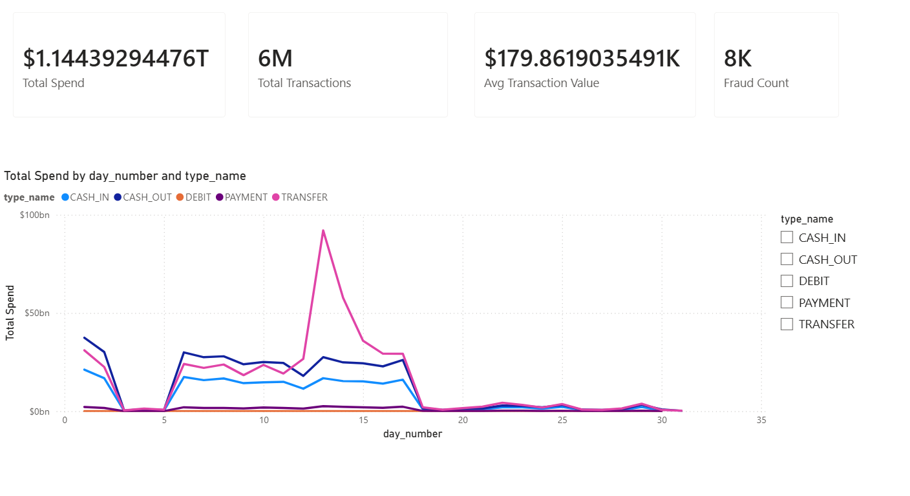
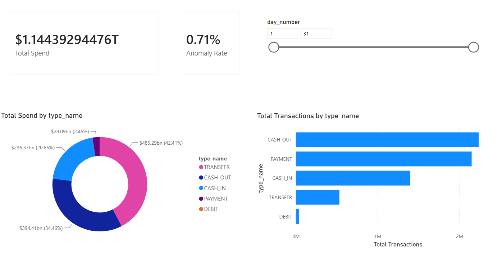
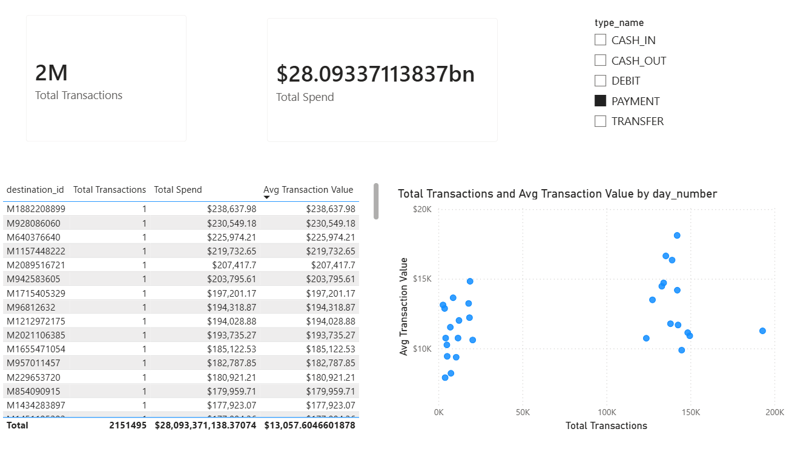
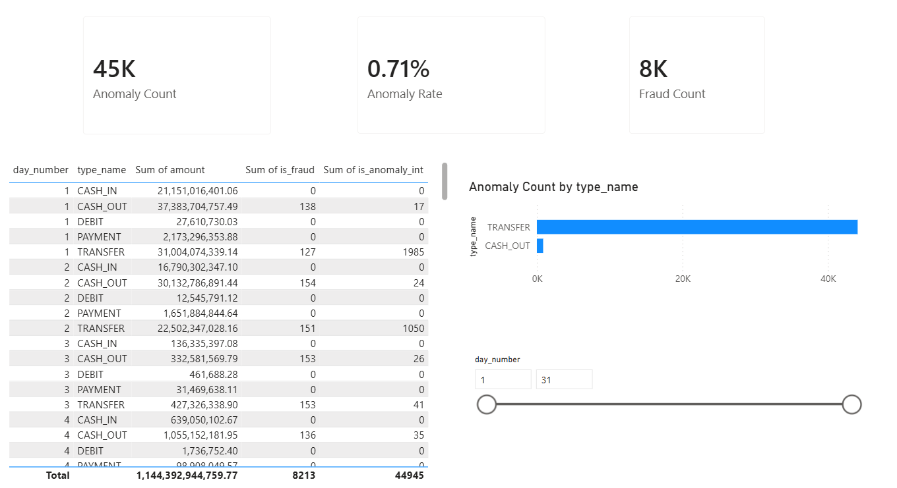

# Financial Transactions Dashboard

A data warehousing and business intelligence project built on a synthetic financial transactions dataset. The project covers the full data engineering lifecycle  from raw CSV ingestion through a Python ETL pipeline, into a PostgreSQL star schema data warehouse, and finally visualised in a Power BI dashboard.

---

## Dashboard Preview

| Overview | Category Breakdown |
|---|---|
|  |  |

| Merchant Analysis | Anomaly Tracker |
|---|---|
|  |  |

---

## Tech Stack

| Layer | Tool |
|---|---|
| Data source | PaySim Synthetic Financial Dataset (Kaggle) |
| ETL pipeline | Python, pandas, psycopg2 |
| Data warehouse | PostgreSQL |
| Dashboard | Power BI Desktop |
| Environment | python-dotenv, virtualenv |

---

## Architecture

```
CSV (6.3M rows)
     │
     ▼
Python ETL (etl.py)
  - Extract: read CSV, filter rows newer than high-watermark
  - Transform: clean, enrich, flag anomalies (Z-score)
  - Load: batch insert via psycopg2 with ON CONFLICT DO NOTHING
  - Watermark: update etl_metadata table after successful load
     │
     ▼
PostgreSQL — staging schema
  ├── staging.raw_transactions
  └── staging.etl_metadata      # high-watermark tracking
     │
     ▼
PostgreSQL — warehouse schema (Star Schema)
  ├── warehouse.fact_transactions
  ├── warehouse.dim_date
  ├── warehouse.dim_account
  ├── warehouse.dim_destination
  └── warehouse.dim_transaction_type
     │
     ▼
Power BI Dashboard
  ├── Overview
  ├── Category Breakdown
  ├── Merchant Analysis
  └── Anomaly Tracker
```

---

## Dataset

**Synthetic Financial Datasets for Fraud Detection (PaySim)**
- Source: [Kaggle](https://www.kaggle.com/datasets/ealaxi/paysim1)
- 6,362,620 transactions simulating 30 days of mobile money activity
- Features: transaction type, amount, account balances, fraud flags

---

## Star Schema

```
                    ┌──────────────────┐
                    │   dim_date       │
                    │──────────────────│
                    │ date_key (PK)    │
                    │ step             │
                    │ hour_of_day      │
                    │ day_number       │
                    │ week_number      │
                    │ month_number     │
                    │ quarter          │
                    │ is_weekend       │
                    └────────┬─────────┘
                             │
┌──────────────────┐         │         ┌──────────────────────┐
│   dim_account    │         │         │  dim_transaction_type│
│──────────────────│         │         │──────────────────────│
│ account_key (PK) │         │         │ type_key (PK)        │
│ account_id       │         │         │ type_name            │
│ account_type     │         │         └──────────┬───────────┘
└────────┬─────────┘         │                    │
         │          ┌────────┴──────────┐         │
         └──────────┤ fact_transactions ├─────────┘
                    │───────────────────│
                    │ transaction_id PK │
                    │ date_key FK       │
                    │ account_key FK    │
                    │ destination_key FK│
                    │ type_key FK       │
                    │ amount            │
                    │ old_balance_org   │
                    │ new_balance_org   │
                    │ old_balance_dst   │
                    │ new_balance_dst   │
                    │ is_fraud          │
                    │ is_flagged_fraud  │
                    │ is_anomaly        │
                    └────────┬──────────┘
                             │
                    ┌────────┴─────────┐
                    │ dim_destination  │
                    │──────────────────│
                    │ destination_key  │
                    │ destination_id   │
                    │ destination_type │
                    └──────────────────┘
```

---

## Project Structure

```
financial-transactions-dwh/
├── etl.py                  # Python ETL pipeline (incremental load)
├── run_etl.bat             # Windows batch file for Task Scheduler
├── requirements.txt        # Python dependencies
├── .gitignore
├── .env.example            # Environment variable template
├── screenshots/            # Power BI dashboard screenshots
│   ├── 01_overview.png
│   ├── 02_category_breakdown.png
│   ├── 03_merchant_analysis.png
│   └── 04_anomaly_tracker.png
└── README.md
```

---

## Getting Started

### Prerequisites
- Python 3.11+
- PostgreSQL 14+
- Power BI Desktop
- PostgreSQL ODBC driver (psqlodbc x64)

### 1. Clone the repo
```bash
git clone https://github.com/Dineth-Wickremasinghe/financial-transactions-dwh.git
cd financial-transactions-dwh
```

### 2. Set up Python environment
```bash
python -m venv venv
venv\Scripts\activate       # Windows
source venv/bin/activate    # Mac/Linux
pip install -r requirements.txt
```

### 3. Configure environment variables
Create a `.env` file in the project root:
```
DB_HOST=localhost
DB_PORT=5432
DB_NAME=fin_dw
DB_USER=postgres
DB_PASSWORD=your_password_here
```

### 4. Set up PostgreSQL
Create the database and schemas in PostgreSQL:
```sql
CREATE DATABASE fin_dw;
CREATE SCHEMA staging;
CREATE SCHEMA warehouse;
```

Then create the staging and warehouse tables following the star schema design above.

### 5. Download the dataset
Download the PaySim dataset from [Kaggle](https://www.kaggle.com/datasets/ealaxi/paysim1) and place the CSV in a `data/` folder:
```
data/PS_20174392719_1491204439457_log.csv
```

### 6. Run the ETL pipeline
```bash
python etl.py
```

This will extract, clean, and load 6.3 million rows into the staging schema.

### 7. Build the star schema
Run the warehouse SQL scripts in pgAdmin to populate the dimension and fact tables.

### 8. Connect Power BI
Connect Power BI Desktop to your local PostgreSQL instance using the psqlodbc x64 ODBC driver and import the warehouse tables.

### 9. Schedule the ETL (Windows)
Run `run_etl.bat` manually or set it up in Windows Task Scheduler to run automatically on a daily schedule:
- Open Task Scheduler → Create Basic Task
- Set trigger to Daily at your preferred time
- Set action to Start a Program → browse to `run_etl.bat`
- The ETL will check the high-watermark and only load new rows each run

---

## Dashboard Pages

| Page | Description |
|---|---|
| Overview | KPI cards for total spend, transactions, avg value, fraud count. Line chart of spend by day and transaction type. |
| Category Breakdown | Donut chart of spend by type. Bar chart of transaction counts. Day range slicer. |
| Merchant Analysis | Destination account table ranked by volume and spend. Scatter plot of daily frequency vs avg spend. |
| Anomaly Tracker | Anomaly and fraud KPI cards. Flagged transactions table. Bar chart of anomalies by transaction type. |

---

## Key Concepts Covered

- **Star schema design** — fact and dimension tables, surrogate keys, foreign key relationships
- **ETL pipeline** — extract, transform, load with pandas and psycopg2
- **Staging layer** — raw data landing zone separated from the warehouse
- **Anomaly detection** — Z-score flagging (transactions > 3 standard deviations from mean)
- **DAX measures** — Total Spend, MoM Change, Anomaly Rate, Fraud Count
- **Incremental loading** — high-watermark pattern for efficient pipeline reruns
- **Idempotent loads** — ON CONFLICT DO NOTHING ensures safe re-runs without duplicates
- **Pipeline scheduling** — Windows Task Scheduler for automated daily ETL runs

---

## Notes

- The Power BI `.pbix` file is not included in this repo due to GitHub's 100MB file size limit. Screenshots of all 4 report pages are available in the `screenshots/` folder.
- The dataset CSV is not included due to file size. Download it directly from Kaggle using the link above.

---

## Author

**Dineth Wickremasinghe**  

[GitHub](https://github.com/Dineth-Wickremasinghe) · [LinkedIn](https://linkedin.com/in/your-linkedin)
